# Android1@geekbrains
## Lesson6: fragments app:Notes
### Preview
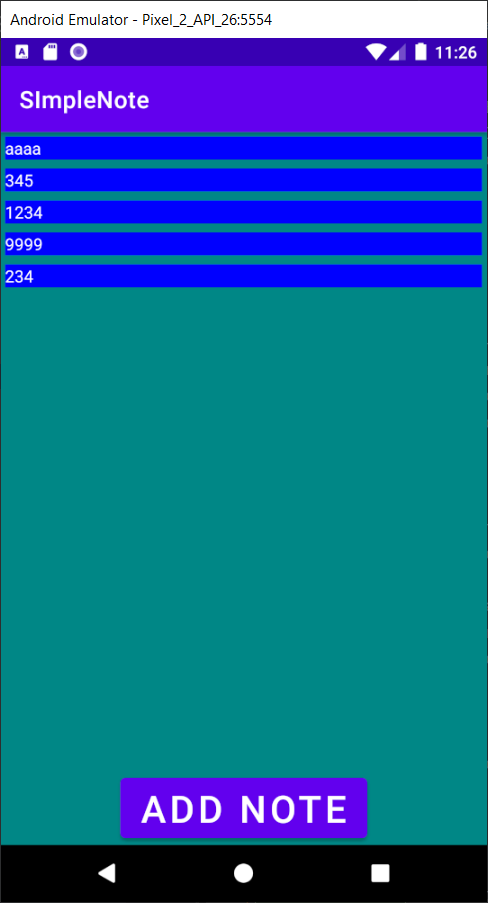
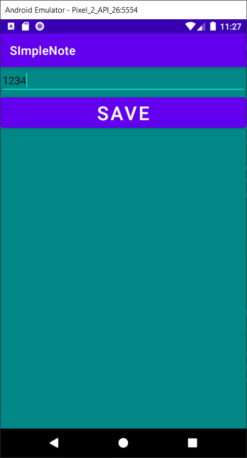
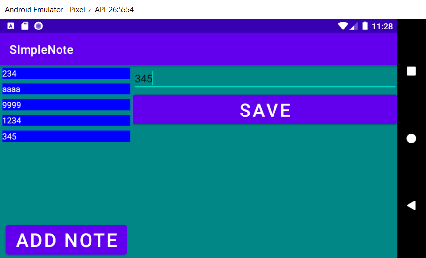

## Lesson7: fragments navigation, BottomNavigationView
### Preview
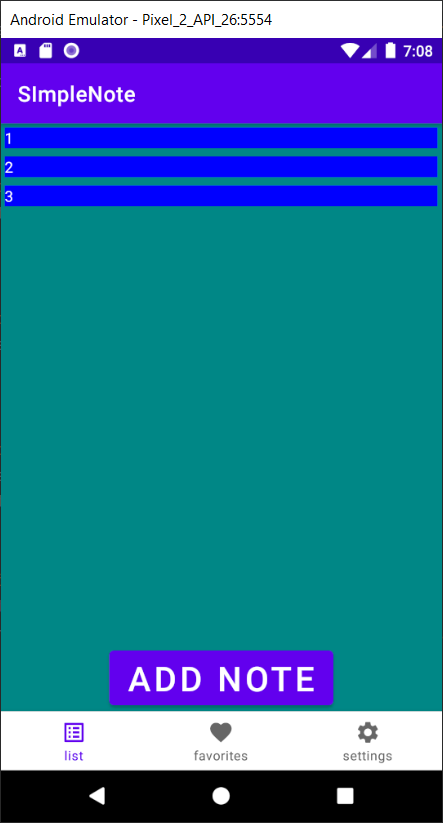
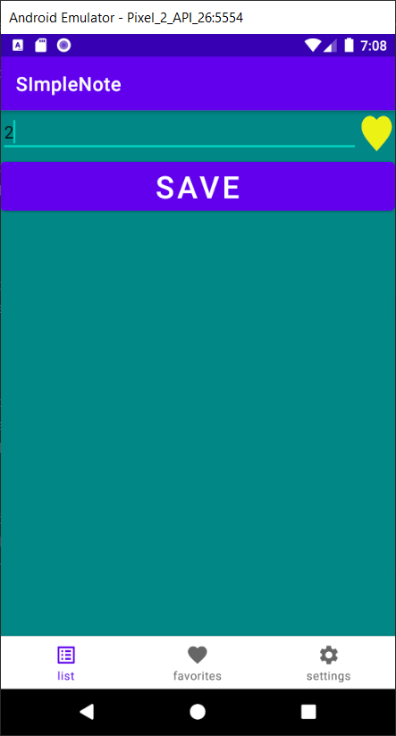
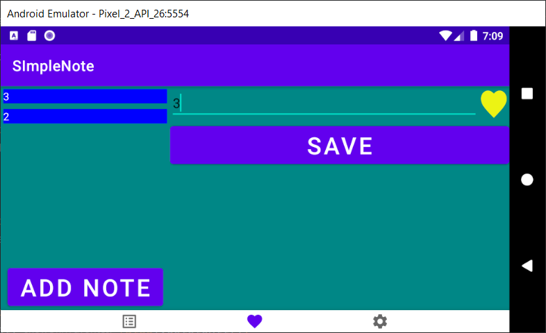

## Lesson8: RecyclerView
### Preview
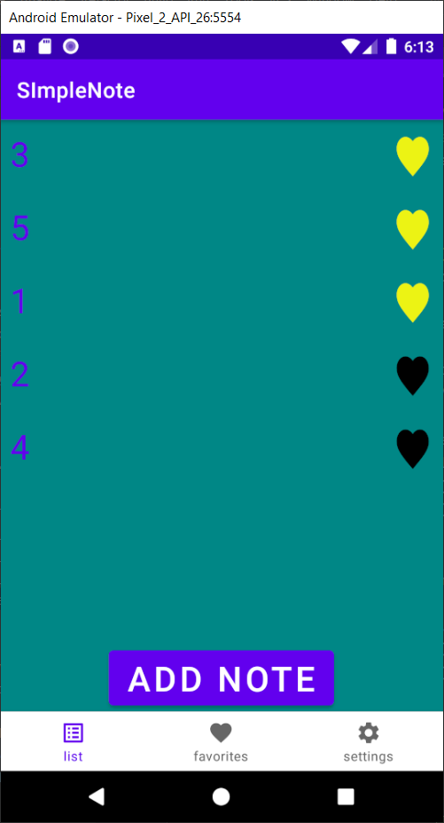

## Lesson9: context menus, viewType, different ViewHolders
### Preview
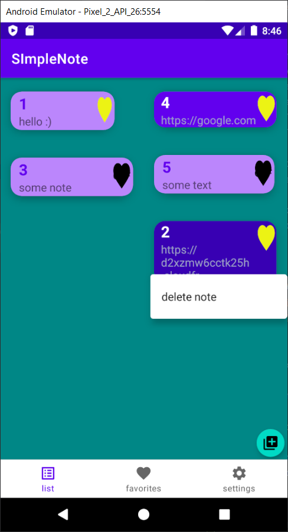
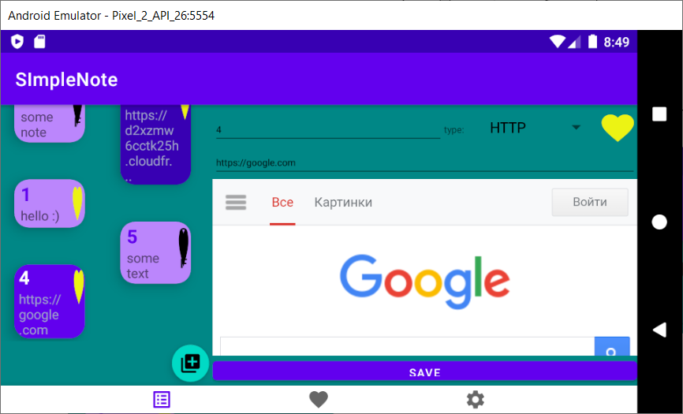

## Lesson10: firestore, google auth
### Preview
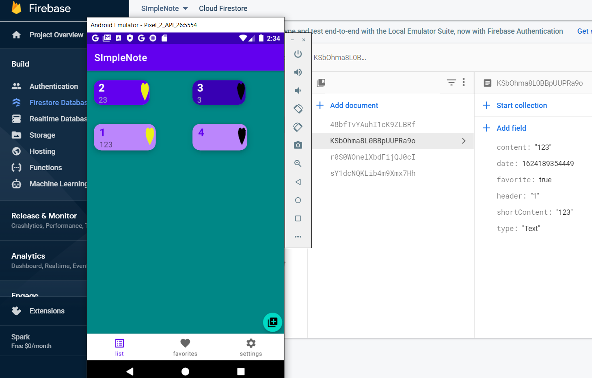
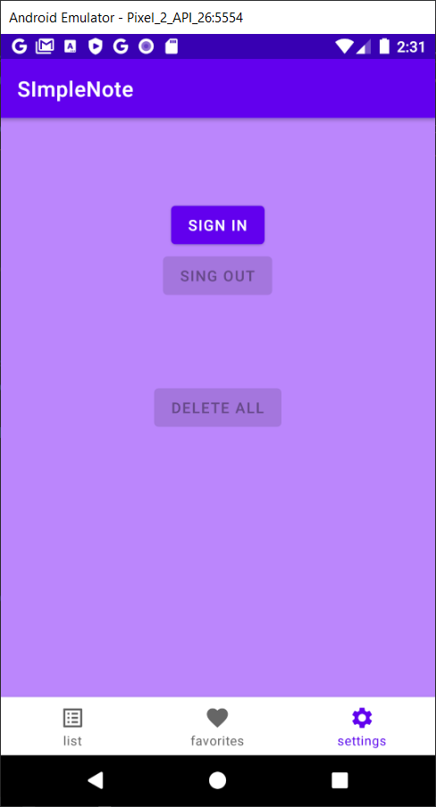

## Lesson11: dialogs
### Preview
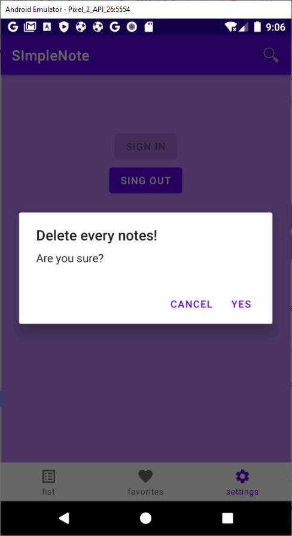
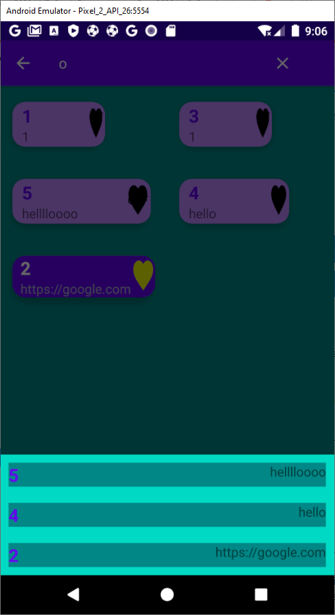

